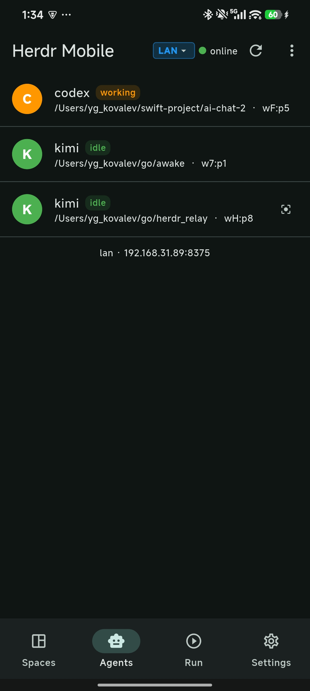
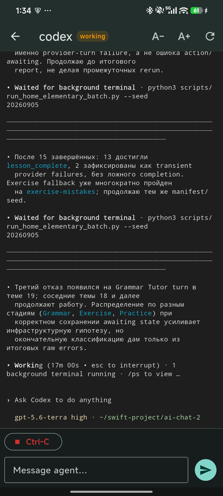
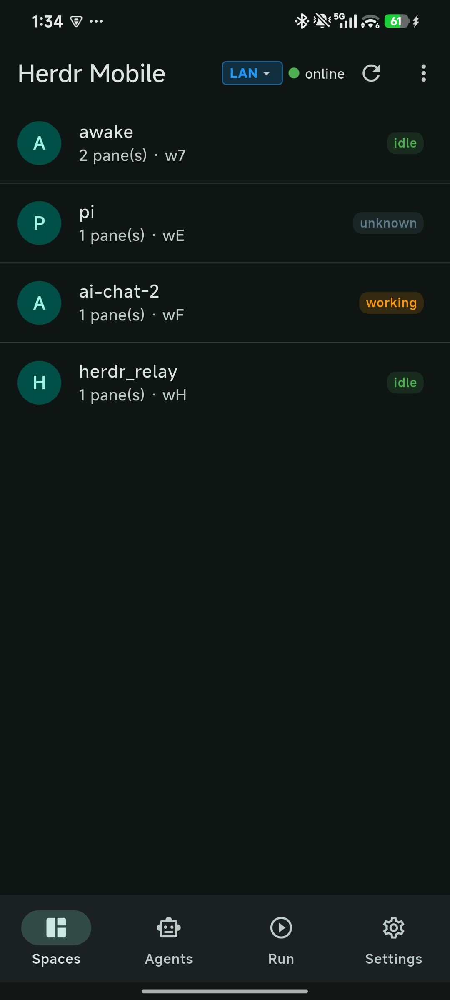
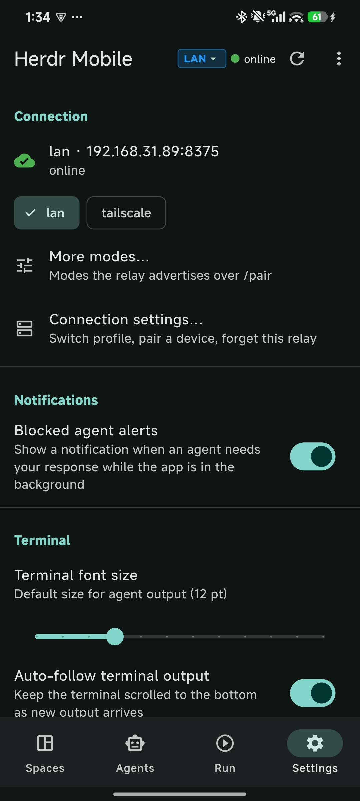

# Herdr Mobile

Remote control for [herdr](https://herdr.dev) AI agents from your phone.

Herdr Mobile installs a small **relay** on your laptop (macOS or Linux), pairs with
a **mobile app** by scanning a QR code, and lets you watch agent output, send
prompts, and manage workspaces while you are away from the keyboard.

- **Relay** (Go) — a single binary that talks to herdr over its unix socket and
  exposes a WebSocket/HTTP API to the phone. Runs as its own system service, so
  it survives herdr restarts.
- **Mobile app** (Flutter) — Android APK (iOS on the roadmap), paired via QR.
- **herdr plugin** — installs, configures, and exposes the relay from inside
  herdr (status + QR pairing pane).


## Table of contents

- [Installation](#installation)
- [Using Herdr Mobile](#using-herdrelay)
- [Troubleshooting](#troubleshooting)
- [Architecture](#architecture)
- [Repository layout](#repository-layout)
- [Development](#development)
- [Documentation](#documentation)
- [Contributing & license](#contributing--license)

---

## Installation

### Step 1 — Check you have the prerequisites

| What | Minimum | Notes |
|------|---------|-------|
| [herdr](https://herdr.dev) | 0.8.0 | make sure it works: `herdr --version` |
| Go | 1.26 | only needed to build the relay from source |
| OS | macOS / Linux | the relay targets both; macOS is the primary one |
| Phone | Android | for the app; iOS is on the roadmap |

The **one-liner** below covers everything: it installs the plugin, builds the
relay, and starts it as a system service. Pick one of the two methods.

### Step 2A — Install with one command (recommended)

From a terminal on your laptop:

```bash
curl -fsSL https://raw.githubusercontent.com/teasec4/herdr-mobile-app/main/quick-start.sh | bash
```

The script checks that `herdr` and `go` are installed, then asks you how to
install:

- **1 — Install from GitHub (recommended)** — pulls the plugin from the repo.
- **2 — Install from a local checkout** — for development; it asks for the repo
  path, links the plugin, and builds the relay.

When it finishes, the script verifies the relay is up by calling its health
endpoint and prints the next steps (show QR, install the app, scan).

### Step 2B — Install the plugin manually

Same result, one command:

```bash
herdr plugin install teasec4/herdr-mobile-app/plugin
```

### What the installer does (and why it matters)

- Builds the Go relay into `plugin/bin/herdrelay`.
- Installs it as a **launchd service** named `com.herdrelay.relay` (on macOS).
  It autostarts at login and keeps running **even when herdr is not running** —
  that is why the relay is a separate process and not a herdr plugin hook.
- Writes service logs to `~/.local/state/herdrelay/`.
- Generates a **pairing token** (stored as a file) that later goes into the QR
  link. The relay will refuse connections without this token.

### Step 3 — Verify the relay is running

```bash
curl http://127.0.0.1:8375/healthz
```

You should see `{"ok":true}`. (Windows is not supported; the relay listens on
port `8375` by default.)

---

## Using Herdr Mobile

From first pairing to daily use — the whole flow, step by step.

### Step 1 — Show the pairing QR code

The pairing link bundles everything the phone needs (host address + token) into
one QR code. There are two ways to show it:

**From inside herdr** (recommended):

```bash
herdr plugin action invoke show-pair-link --plugin herdrelay.events
```

or use the menu: **Herdr Mobile → Show phone link / QR**.

A herdr pane opens with the relay status and the QR code (printed as terminal
half-blocks right in the pane). The pane closes by itself after a few seconds.

**Directly from the terminal:**

```bash
./plugin/bin/herdrelay pair --qr      # prints the QR code
./plugin/bin/herdrelay pair           # prints just the pairing link as text
```

> **Note:** this shows the *current* token — it does **not** reset it. If you
> want to re-pair, just rescan; if you want a brand-new token (old session
> revoked), see [Troubleshooting: reset the pairing token](#reset-the-pairing-token).

### Step 2 — Install the app on your phone

**Android — download & install:**

1. On your phone, open the
   [Releases](https://github.com/teasec4/herdr-mobile-app/releases) page.
2. Under the newest release, tap the APK asset (e.g. `Herdr Mobile-v0.3.0.apk`) to
   download it.
3. Open the downloaded file. Android warns that the app is from an *unknown
   source* — expected, since this APK is not on Google Play. Allow the install
   (Settings → allow "Install unknown apps" for your browser, or tap
   **Install anyway**).
4. When the app asks for camera permission, grant it — it is needed for
   scanning the pairing QR code.

> The APK is signed with a development key and is not on Google Play, which is
> why Android shows the unknown-source warning. That is normal for a sideloaded
> app.

**iOS:** coming soon (TestFlight / App Store).

### Step 3 — Scan the QR and connect

1. Open the installed app.
2. Tap **Scan QR**.
3. Point the camera at the QR code from step 1.
4. The app saves the pairing profile and connects automatically.

That's it — you should see your agents with live status and output.

### Step 4 — What you can do in the app

#### Home — agents at a glance

Live list of herdr agents and panes with their current status (`idle`,
`working`, `blocked`, `done`). Tap an agent to open it.



*Home screen: agent list with live status.*

#### Agent — live terminal

Follows the agent's output as it streams, with auto-scroll. Use the controls to
adjust font size, send a **prompt**, or send **keypresses** (Esc, Ctrl-C, text).



*Agent screen: live terminal output and input controls.*

#### Run / Spaces — workspaces

Manage herdr workspaces and start runs from the phone.



*Run / Spaces screen.*

#### Connection — which network path the app uses

Shows which connection modes are reachable and lets you switch between them
manually or re-test reachability. Useful when you move between networks.

*(Screenshot for this screen not added yet — will be linked here when it is.)*

#### Settings — pairing profiles and preferences

Manage saved pairing profiles, output polling behavior, and app preferences.



*Settings screen.*

### Step 5 — Connection modes: LAN, Tailscale, Funnel, Gateway

The relay figures out which modes are reachable on your machine and puts them
all into the QR link. The app picks a working one automatically (with manual
override on the Connection screen).

| Mode | When to use | Setup required |
|------|-------------|----------------|
| **LAN** | Phone and laptop on the same Wi-Fi | None (default) |
| **Tailscale** | Both devices in the same tailnet — works from anywhere | Install Tailscale on **both** devices |
| **Funnel** | Phone has no Tailscale, you want a public URL | `tailscale funnel 8375` on the laptop |
| **Gateway** | VPS / firewall bypass, access without Tailscale | A central gateway server (see docs/04-gateway.md) |

**Switching modes** — no rebuild needed:

```bash
bash plugin/configure.sh lan          # local network (default)
bash plugin/configure.sh tailscale    # direct tailnet, no port forwarding
bash plugin/configure.sh funnel       # public HTTPS via Tailscale Funnel
bash plugin/configure.sh gateway URL  # outbound to a central gateway
```

`configure.sh` rewrites the service configuration and restarts the relay.
**After changing the mode, show a fresh QR and rescan it in the app** — the
address in the link changes with the mode.

### Step 6 — Everyday operations

**Check the relay is up:**

```bash
curl http://127.0.0.1:8375/healthz   # → {"ok":true}
./plugin/bin/herdrelay status        # status summary
```

**Restart the relay (macOS):**

```bash
launchctl kickstart -k gui/$(id -u)/com.herdrelay.relay
```

**View logs:**

```bash
tail -f ~/.local/state/herdrelay/relay.log      # stdout
tail -f ~/.local/state/herdrelay/relay.err.log  # stderr
herdr plugin log list --plugin herdrelay.events # plugin logs
```

**Rebuild + restart after code changes** (dev loop, from the repo root):

```bash
bash plugin/redeploy.sh
./relay-status.sh update     # alternative entry point with a status summary
```

The phone reconnects as-is: the pairing token does **not** change on redeploy.

---

## Troubleshooting

**The relay is not responding (`/healthz` times out)**

- Check whether the service is loaded:
  `launchctl list | grep herdrelay`
- Restart it:
  `launchctl kickstart -k gui/$(id -u)/com.herdrelay.relay`
- Inspect the error log: `tail -f ~/.local/state/herdrelay/relay.err.log`
- If it still won't come up within ~10s, re-run `bash plugin/install.sh`.

**The phone can't connect**

- **LAN:** make sure both devices are on the same network and port 8375 is not
  blocked by a firewall.
- **Only LAN is listed in the app:** Tailscale wasn't running when the QR was
  generated. Start it (`sudo tailscale up`), run `bash plugin/redeploy.sh`, then
  on the phone open Connection → Refresh modes.
- **Rescan the QR:** the token may have changed after a relay reinstall.

**Change / reset the pairing token** <a id="reset-the-pairing-token"></a>

`herdrelay pair --qr` shows the **current** token. To force a brand-new one,
delete the token file and restart the relay:

```bash
rm ~/.config/herdr/herdrelay.token
launchctl kickstart -k gui/$(id -u)/com.herdrelay.relay
./plugin/bin/herdrelay pair --qr     # now shows a fresh token
```

> **Warning:** this revokes every existing pairing — rescans will be required
> on all phones.

For the full guide with many more failure scenarios see
[INSTALL.md](INSTALL.md).

---

## Architecture

Short version — details live in [docs/](docs/).

```
┌────────────┐   WebSocket / HTTP    ┌──────────┐   unix socket   ┌─────────┐
│ Mobile app │◄─────────────────────►│  Relay   │◄────────────────►│  herdr  │
│ (Flutter)  │  (JSON frames, SSE)   │  (Go)    │  event stream   │  CLI    │
└────────────┘                       └──────────┘                 └─────────┘
```

- **Relay** (`cmd/relay/`, `internal/`) — the only process on the laptop beyond
  herdr itself. It subscribes to herdr's socket events
  (`pane.agent_status_changed`, `pane.output_changed`) and streams them to the
  phone over WebSocket with an HTTP/SSE fallback. It is a separate system
  service on purpose: it keeps working and stays reachable even when herdr's TUI
  is closed or being restarted. Transport and protocol details:
  [docs/03-relay.md](docs/03-relay.md), [docs/01-architecture.md](docs/01-architecture.md).
- **Mobile app** (`client/`) — layered Flutter app: `core/transport` (WebSocket +
  HTTP fallback), `core/protocol` (frames, request-response), `core/connection`
  (lifecycle, mode service, auto-fallback), `services/` (typed client),
  `pages/` (UI). See [docs/05-flutter-app.md](docs/05-flutter-app.md).
- **Plugin** (`plugin/`) — registers the relay with herdr, provides the QR setup
  pane and the mode configuration action. There is intentionally **no event
  hook**: status/output reach the relay via herdr's socket subscription, so a
  plugin hook would only duplicate them.
- **Pairing** — the relay generates a token and a universal link bundling all
  detected modes (LAN / Tailscale / Funnel / Gateway). The app scans the QR,
  stores the profile, and connects. One QR covers every reachable path: `ws://`
  for LAN/Tailscale under a trusted network, `https://` for Funnel, `wss://`
  for Gateway. See [docs/07-onboarding.md](docs/07-onboarding.md).

## Repository layout

```
cmd/relay/     relay binary: /ws, /api/rpc, /api/events/stream (SSE), /pair,
               /healthz; `relay pair [--qr]`, `relay status` subcommands
internal/      Go layers: domain, service, infrastructure (herdr CLI + socket
               events, netdetect), transport (ws, http)
plugin/        herdr plugin: QR pairing pane, install/redeploy, mode config
client/        Flutter app: transport / protocol / connection core + UI
docs/          architecture, herdr API reference, screenshots, etc.
```

## Development

```bash
# Link the plugin for local development (no rebuild happens on link)
herdr plugin link "$PWD/plugin"
bash plugin/install.sh          # build relay + install launchd service
bash plugin/redeploy.sh         # rebuild + restart after changes

# Go tests
go test ./...

# Flutter tests
cd client
flutter test
flutter analyze
flutter build apk --release     # → build/app/outputs/flutter-apk/app-release.apk
```

See [CONTRIBUTING.md](CONTRIBUTING.md) for the full contribution guide.

## Documentation

- [INSTALL.md](INSTALL.md) — detailed installation and troubleshooting
- [01 — Architecture](docs/01-architecture.md)
- [02 — herdr Integration](docs/02-herdr-integration.md)
- [03 — Relay (Go)](docs/03-relay.md)
- [04 — Gateway (VPS)](docs/04-gateway.md)
- [05 — Flutter App](docs/05-flutter-app.md)
- [07 — QR Onboarding](docs/07-onboarding.md)
- [10 — herdr API Reference](docs/10-herdr-api.md)
- [Screenshots](docs/screenshots/README.md) — where to drop the app screenshots

## Contributing & license

Contributions are welcome — see [CONTRIBUTING.md](CONTRIBUTING.md). This
project is licensed under the [MIT License](LICENSE).

Built for [herdr](https://herdr.dev). Remote connectivity via
[Tailscale](https://tailscale.com).